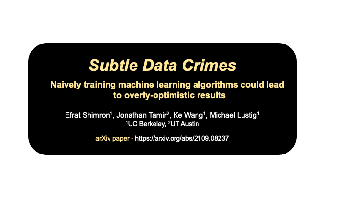

# Subtle Data Crimes

Official github repository for the paper [Subtle data crimes: naively training machine learning algorithms could lead to overly-optimistic results](https://arxiv.org/abs/2109.08237) and [ISMRM abstract](https://index.mirasmart.com/ISMRM2021/PDFfiles/0222.html).

Notice: this repo is still under construction. It will be finalized over the next couple of weeks (Dec 2021).





## Video

A 5-min oral presentation that explains this research is [here](https://ismrm-smrt21.us3.pathable.com/meetings/virtual/t6jwNsra7cnLEAdRZ) (this link requires registration to the ISMRM-2021 conference).


## Installation
To use this package:

1. Clone or download it.

2. Install the required python packages (tested with python 3.7 on Ubuntu 20.04 LTS) by running (creating a virtual enviroment is recommened):
```bash
pip install --upgrade pip
pip install -e .
```


3. In order to fully reproduce our experiments, data should be downloaded from the FastMRI database (see details in the next section).


## Data

All the data used in this research was obtained from the [FastMRI database](https://fastmri.org/).

To download the data, you need to request access to FastMRI and follow their procedures.

Comments:
- After downloading the data, please copy the file
```
file_brain_AXT2_207_2070504.h5
```
from the FastMRI multi-coil brain training data should be copied to the folder:
```
crime_1_zero_padding/brain_data
```


- For full reproducibility, we mention that the next two files from the FastMRI multi-coil knee training data (which include pathology examples)
```
file1000425.h5
file1002455.h5
```
were used in our pathology experiments. However, there's no need to place them in a separate folder, the code will find them in the FastMRI training data folder


## Pre-trained networks

The weights of our pre-trained networks will soon be publicly available here:
https://berkeley.box.com/s/lamdqhruiwxuxtwwjiv8xly5mohshot9


## Acknowledgements

The Compressed Sensing code implemented was based on [Sigpy](https://sigpy.readthedocs.io/en/latest/index.html).

The Dictionary Learning algorithm implementation is based on Jon Tamir's [ISMRM 2020 educational tutorial](https://github.com/utcsilab/dictionary_learning_ismrm_2020).


## Terms of use

This repository is published under the MIT license. It may be used only for research/educational purpose. It may not be used for clinical diagnosis or any other clinical purpose.

## Citation

When using our code in your future publications, please cite our paper. Thank you.

```
@article{shimron2021subtle,
  title={Subtle inverse crimes: Na$\backslash$" ively training machine learning algorithms could lead to overly-optimistic results},
  author={Shimron, Efrat and Tamir, Jonathan I and Wang, Ke and Lustig, Michael},
  journal={arXiv preprint arXiv:2109.08237},
  year={2021}
}
```

### Contact

Problems? Questions? contact efrat.s@berkeley.edu


Efrat Shimron, UC Berkeley (2021)
