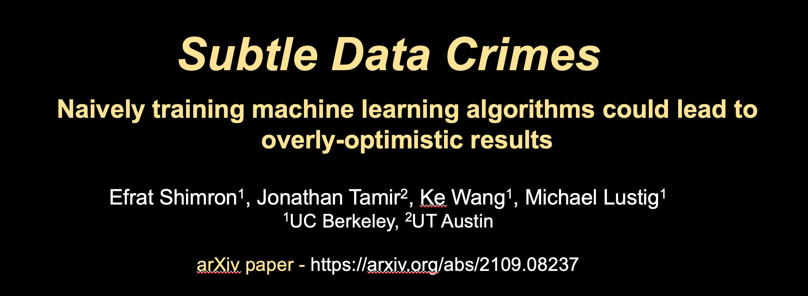

# Subtle Data Crimes
A public repository for reproducing the experiments described in the paper:

""

Shimron et al. "Subtle data crimes: naively training machine learning algorithms could lead to overly-optimistic results" (2021).

The arXiv paper is here: https://arxiv.org/abs/2109.08237

The oral presentation is here (this link requires ISMRM registration): https://ismrm-smrt21.us3.pathable.com/meetings/virtual/t6jwNsra7cnLEAdRZ

Efrat Shimron, UC Berkeley (2021)
