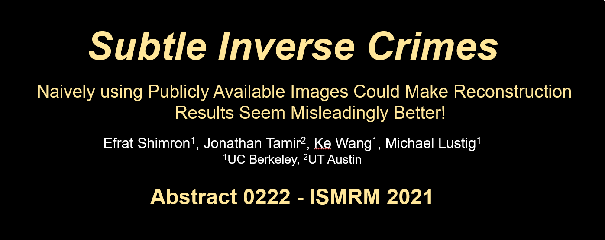

# Subtle Inverse Crimes
A public repository for reproducing the experiments described in the Subtle Inverse Crimes abstract and paper.

Shimron et al. "Subtle Inverse Crimes: Naively using Publicly Available Images Could Make Reconstruction Results Seem Misleadingly Better!". Abstract 0222, ISMRM 2021.

The abstract is here (this link requires ISMRM registration): https://cds.ismrm.org/protected/21MPresentations/abstracts/0222.html

The oral presentation is here (same): https://ismrm-smrt21.us3.pathable.com/meetings/virtual/t6jwNsra7cnLEAdRZ

Efrat Shimron, UC Berkeley (2021)
