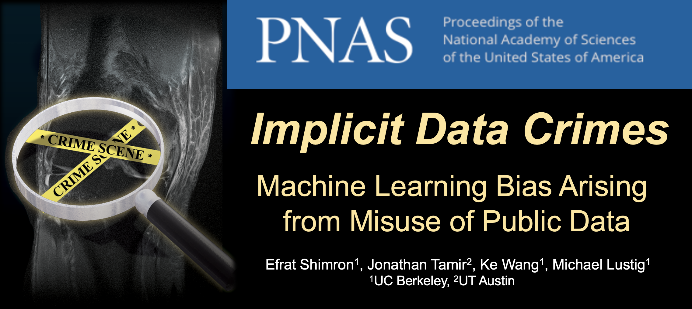

# Data Crimes

Code: [](https://zenodo.org/badge/latestdoi/367488087)

Data: [](https://doi.org/10.5281/zenodo.6018526)

Official github repository for the paper
"Implicit Data Crimes: Machine Learning Bias Arising from Misuse of Public Data". The paper has been accepted to PNAS (Feb 2022) and will be published soon with full open access.

Here are our arXiv preprint
[Subtle data crimes: naively training machine learning algorithms could lead to overly-optimistic results](https://arxiv.org/abs/2109.08237) and [ISMRM'21 abstract](https://index.mirasmart.com/ISMRM2021/PDFfiles/0222.html).




### Notice: repository name change
The repository's name recently changed from "subtle_data_crimes" to "data_crimes".

- If you already cloned the repository with the previous name, you can update the remote origin using this git command:
```git remote set-url origin git@github.com:mikgroup/data_crimes.git```

- The code package is still named ```subtle_data_crimes```, so
importing functions is done as follows: ```subtle_data_crimes.functions.utils import calc_pad_half```
or
```import subtle_data_crimes.functions.utils as utils```


## Video

A 20-minute talk about this research is available [here](https://www.youtube.com/watch?v=sGJQqqpOwNs&t=68s) (this talk was recorded during the MRI Together 2021 conference), and a 5-min talk is [here](https://ismrm-smrt21.us3.pathable.com/meetings/virtual/t6jwNsra7cnLEAdRZ) (this link requires registration to the ISMRM'21 conference).


## Installation
To use this package:

1. Clone or download it.

2. Install the required python packages (tested with python 3.7 on Ubuntu 20.04 LTS) by running (creating a virtual enviroment is recommened):
```bash
pip install --upgrade pip
pip install -e .
```

    If you prefer to install using coda, you can also run this:

     ```conda install -c intel mkl-service==2.3.0```

3. Install the ```pytorch_wavelets library``` following the instructions [here](https://pytorch-wavelets.readthedocs.io/en/latest/readme.html). Specifically:

  ```
  git clone https://github.com/fbcotter/pytorch_wavelets
  cd pytorch_wavelets
  pip install .
  ```

4. In order to fully reproduce our experiments, data should be downloaded from the FastMRI database (see details in the next section).


## Data

All the data used in this research was obtained from the [FastMRI database](https://fastmri.org/).

To download the data, you need to request access to FastMRI and follow their procedures.

Comments:
- After downloading the data, please copy the file
```
file_brain_AXT2_207_2070504.h5
```
from the FastMRI multi-coil brain training data should be copied to the folder:
```
crime_1_zero_padding/brain_data
```


- For full reproducibility, we mention that the next two files from the FastMRI multi-coil knee training data (which include pathology examples)
```
file1000425.h5
file1002455.h5
```
were used in our pathology experiments. However, there's no need to place them in a separate folder, the code will find them in the FastMRI training data folder


## Pre-trained networks

The weights of our pre-trained networks are publicly available on [Zenodo](https://zenodo.org/record/6018526#.YgNbWPXMJqs).

[](https://doi.org/10.5281/zenodo.6018526)

## Acknowledgements

The Compressed Sensing implementation was based on [Sigpy](https://sigpy.readthedocs.io/en/latest/index.html).

The Dictionary Learning algorithm implementation is based on Jon Tamir's [ISMRM 2020 educational tutorial](https://github.com/utcsilab/dictionary_learning_ismrm_2020).

The authors acknowledge funding from grants U24 EB029240-01, R01EB009690, R01HL136965.

## Terms of use

This repository is published under the MIT license. It may be used only for research/educational purpose. It may not be used for clinical diagnosis or any other clinical purpose.

## Citation


When using our code in your future publications, please cite our paper. Thank you.

```
@article{shimron2021subtle,
  title={Subtle inverse crimes: Na$\backslash$" ively training machine learning algorithms could lead to overly-optimistic results},
  author={Shimron, Efrat and Tamir, Jonathan I and Wang, Ke and Lustig, Michael},
  journal={arXiv preprint arXiv:2109.08237},
  year={2021}
}
```

### Contact

Problems? Questions? contact efrat.s@berkeley.edu


Efrat Shimron, UC Berkeley (2022)
