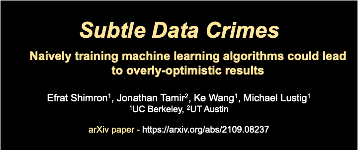

# Subtle Data Crimes

Official github repository for the paper [Subtle data crimes: naively training machine learning algorithms could lead to overly-optimistic results](https://arxiv.org/abs/2109.08237).

Notice: this repo is still under construction. It will be finalized over the next couple of weeks (Dec 2021).

""





---

## Video

A 5-min oral presentation that explains this researc is here (this link requires ISMRM-2021 registration): https://ismrm-smrt21.us3.pathable.com/meetings/virtual/t6jwNsra7cnLEAdRZ

------------
## Installation
To use this package, install the required python packages (tested with python 3.8 on Ubuntu 20.04 LTS):
```bash
pip install -r requirements.txt
```


Installation

1. Clone or download this repository
2. Run requirements.

----

### Data

All the data used in this research was obtained from the FastMRI database, which is here:

https://fastmri.org/

To download the data, you need to request access to FastMRI and follow their procedures.

---

### Pre-trained networks

The weights of our pre-trained networks are publicly available here:
https://berkeley.box.com/s/lamdqhruiwxuxtwwjiv8xly5mohshot9


---


If you use this git repo for your research, please cite our paper.

---

Contact

problems? questions? ideas for further reserach? contact me!
efrat.s@berkeley.edu


Efrat Shimron, UC Berkeley (2021)
